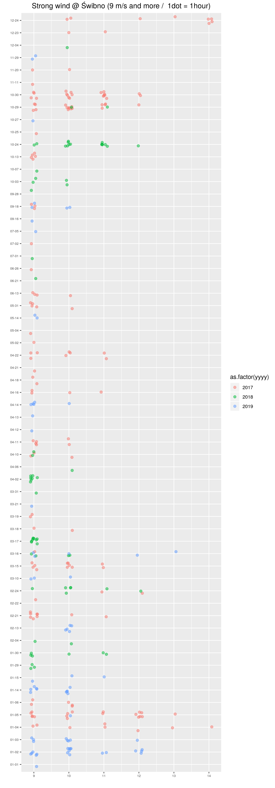
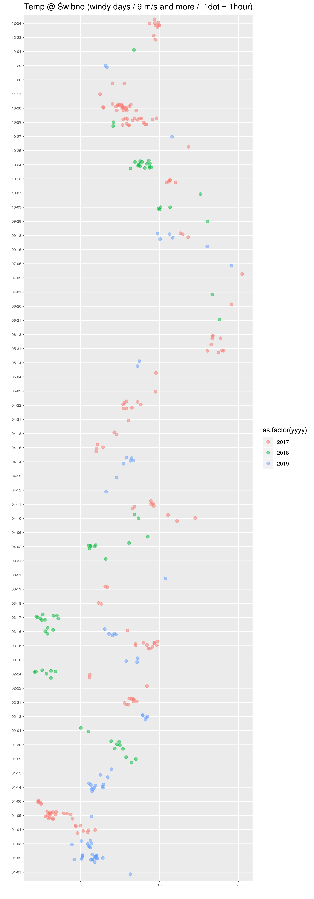

```{r setup, include=FALSE}
knitr::opts_chunk$set(echo = TRUE)
```

## Dane

Dane źródłowe zostały pobrane ze strony https://dane.imgw.pl/data/dane_pomiarowo_obserwacyjne/.
Plik `GDS_00.csv` zawiera wybrane pomiary dla stacji Gdańsk-Świbno, dla której IMGW
publikuje wyniki od 2013 roku.


```{r message=FALSE}
require(ggplot2)
require(dplyr)

d0 <- read.csv("GDS_00.csv", sep = ';',  header=T, na.string="NA");
str(d0)
```

Zmienne:  `yyyy` -- rok; `mm` -- miesiąc; `dd` -- dzień; `hh` -- godzina;
`wdir` -- kierunek wiatru; `wspeed` -- prędkość wiatru; `wgust` -- poryw wiatru;
`tem` -- temperatura; `ice` -- nierejestrowane;
`hum` -- wilgotność; `press` -- ciśnienie.

```{r}
d0$dataCzas <- sprintf("%4i-%02i-%02i", d0$yyyy, d0$mm, d0$dd)
d0$mmddhh <- sprintf("%02i-%02i", d0$mm, d0$dd)
```

## Wiatry

Tylko godziny z wiatrem wiejącym 9m/s z kierunku E-N-W (90-0-270 stopni):

```{r}
d <- d0 %>% filter(wspeed > 8 & (wdir > 270 | wdir < 90)) %>% as.data.frame

d %>% mutate(cat = factor(yyyy)) %>%  group_by (cat) %>% tally() %>%  as.data.frame
```

zatem w 2017 było 155 godzin z wiatrem silniejszym niż 8 m/s z kierunku E-N-W
(roku 2018 było 68 takich godzin a w 2019 73 godziny.)

Na wykresie ograniczamy się do lat 2017--2019. Każda kropka to 1 godzina wiatru
wiejącego z określoną prędkością.

```{r echo=FALSE,warning=FALSE, message=FALSE}
d <- d %>% filter(yyyy > 2016) %>% as.data.frame

p1 <- ggplot(d, aes(  as.factor(mmddhh))) +
  geom_jitter(aes(y = wspeed, colour = as.factor(yyyy) ), size=2, alpha=.5, width = 0.3, height = 0.1) +
  xlab(label="") + ylab(label="") + 
  ggtitle("Strong wind @ Świbno (9 m/s and more /  1dot = 1hour)") +
  theme(axis.text = element_text(size = 6)) +
  theme(plot.title = element_text(hjust = 0.5)) +
  coord_flip()

ggsave(p1, file="windSpeed.png", height=20)
```

{width=90%}

Z wykresu wynika, że w roku 2019 w zasadzie były tylko dwa duże sztormy 2--3 stycznia oraz
okolice 14 styczna. W 2018 było to zaś 29--30 styczna, 16--17 marca oraz 24 października.
W roku 2017 zaś: 4--6 stycznia, 21 luty, 15 marca, 29--30 października oraz 23--24 grudnia.

## Temperatura

Temperatura w wietrzne dni na Świbnie:

```{r echo=FALSE, warning=FALSE, message=FALSE}
p2 <- ggplot(d, aes(  as.factor(mmddhh))) +
  geom_jitter(aes(y = temp, colour = as.factor(yyyy) ), size=2, alpha=.5, width = 0.3, height = 0.1) +
  xlab(label="") + ylab(label="") + 
  ggtitle("Temp @ Świbno (windy days / 9 m/s and more /  1dot = 1hour)") +
  theme(axis.text = element_text(size = 6)) +
  theme(plot.title = element_text(hjust = 0.5)) +
  coord_flip()

ggsave(p2, file="windTemp.png", height=20)
```

{width=90%}
