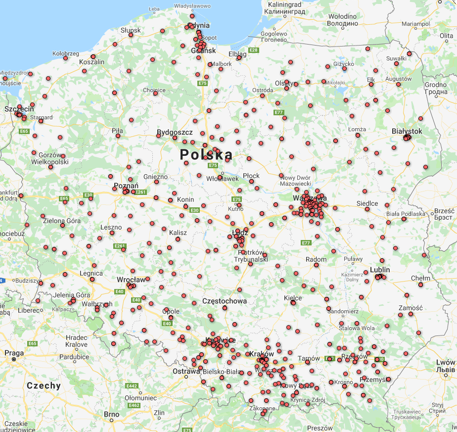
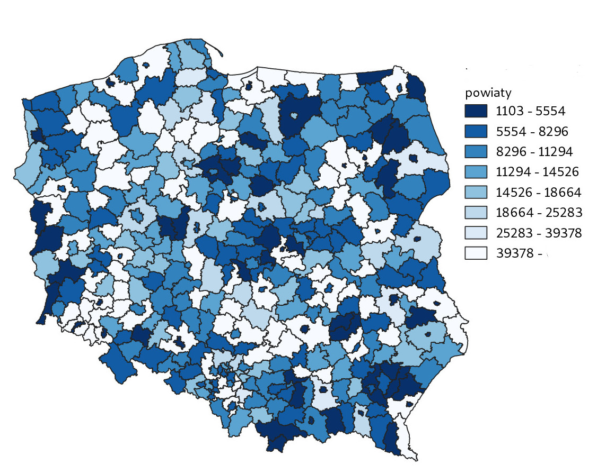

Plik powiatyBySzkolyT.csv to zestawienie 380 powiatów w PL ze względu na:
ppp -- liczbę ludności w wieku przedprodukcyjnym (0--17 lat);
totalp -- łączną liczbę ludności;
ppp.p -- udział ludności w wieku przedprodukcyjnym
w łącznej liczbie ludności (w procentach);
OSM1/OSM2 -- liczbę szkół muzycznych pierwszego i drugiego stopnia;
SM1/SM2 -- liczbę szkół muzycznych pierwszego i drugiego stopnia;
L1/L2 -- odpowiednio OSM1+SM1 oraz OSM2+SM2;
typ -- typ powiaty (m -- miasto na prawach powiatu, p -- "zwykły" powiat)

Dane dotyczące szkół zostały pobrane z rejestru https://rspo.men.gov.pl/. Dane
dotyczące ludności (za rok 2017) z banku danych lokalnych

```{r}
library(ggplot2)
options(scipen=999)
options(digits = 2)

d <- read.csv("powiatyBySzkolyT.csv", sep = ';',  header=T, na.string="NA", colClasses=c("teryt"="character"));
razemS <- sum(d$SM1) + sum(d$SM2) +sum(d$OSM1) + sum(d$OSM2)
```

Liczba szkół wg rodzaju: 
SM1 = `r sum(d$SM1)` (`r sum(d$SM1)/razemS *100`) 
SM2 = `r sum(d$SM2)` (`r sum(d$SM2)/razemS *100`) 
OSM1 = `r sum(d$OSM1)` (`r sum(d$OSM1)/razemS *100`)
OSM2 = `r sum(d$OSM2)` (`r sum(d$OSM2)/razemS *100`).
Poniższa mapa przedstawia lokalizację wszystkich szkół muzycznych w Polsce:



Szkoły koncentrują się w dużych aglomeracjach 
miejskich co jest zrozumiałe. Względny brak szkół
w pasie Gorzów Wlk-Piła-Chojnice 
wynika zapewne z małego zaludnienia tej części Polski.

```{r}
total <- d$L1 + d$L2;
d["total"] <- total;
fivenum(d$total)

powiatyA <- nrow(d)
powiatyA # powinno być 380
pop.total <- sum(d$ppp)
```

Łączna liczba szkół `r sum(d$total)`. 
Średnio w powiecie jest `r mean(d$total)` szkoły (mediana `r median(d$total)`).
Średnia liczba osób w wieku przedprodukcyjnym
w powiecie `r mean(d$ppp)` (łącznie `r pop.total` osób).

## Porównanie województw

Kod TERYT województwa to dwie pierwsze litery kodu powiatu:

```{r}
woj <- substr(d$teryt, 1,2)
d["woj"] <- woj;
```

Porówanie rozkładów szkół muzycznych w województwach
przy pomocy wykresu podełkowego

```{r}
ggplot(d, aes(x=woj, y=total, fill=woj)) + geom_boxplot() + ylab("szkoły") + xlab("") + ggtitle("Średnie na województwo");
```

Średnie dla województw:

```{r}
aggregate(total~woj, data=d, mean)
```
Wykres 

```{r}
ggplot(d, aes(woj)) + geom_bar(aes(fill=woj)) +
coord_flip() + ggtitle("Liczba szkół")
```

## Porównanie powiatów

Histogram rozkładu liczby szkół:

```{r}
ggplot(d, aes(x = total)) + geom_histogram(binwidth = 1) +
ggtitle("powiaty wg liczby szkół muzycznych")

table(d$total)
```


## Tylko powiaty ze szkołami

Ile powiatów nie ma szkół muzycznych?

```{r}
do <- d;
d <- subset (d, total > 0);
powiatyS <- nrow(d)

powiatyS # powiaty ze szkołami
powiatyA - powiatyS # powiaty bez szkół
```

Obliczamy udział osób w wieku przedprodukcyjnym
do łącznej populacji w powiecie, w procentach (UPP):

```{r}
pppDens <- d$ppp/d$total 
d["pppd"] <- pppDens
fivenum(d$pppd);
mean(d$pppd);
```

Powiaty wg wartości UPP (mapa tematyczna):



Rozkłady gęstości UPP według województw:

```{r}
ggplot(d, aes(x=woj, y=pppd, fill=woj)) +
geom_boxplot() + ylab("u/s") + xlab("") + ggtitle("Dzieci/szkołę");
```
Średnie UPP według województw:

```{r}
aggregate(pppd~woj, data=d, mean)
```

Histogram

```{r}
ggplot(d, aes(x = pppd)) + geom_histogram(binwidth = 2000) +
ggtitle("powiaty wg liczby szkół muzycznych")

s <- cut(d$pppd, dig.lab = 8, breaks = seq(0,40000, by=2000))

table(s)

```

## Tylko miejskie

Tylko miasta na prawach powiatu (powiaty miejskie).


```{r}
d <- subset (do, typ == "m");
powiatyM <- nrow(d) # powinno być 66
pm.pop.total <- sum(d$ppp)
```

Liczba powiatów miejskich `r powiatyM` (`r sprintf("%.1f",powiatyM/powiatyA *100)`%).
Łączna liczba szkół `r sum(d$total)`. Średnia liczba osób w wieku przedprodukcyjnym
w powiecie `r mean(d$ppp)` (łącznie `r pm.pop.total` osób 
albo `r pm.pop.total/pop.total *100`% całej populacji osób w wieku przedprodukcyjnym).


Rozkład liczby szkół w miastach na prawach powiatu:

```{r}
ggplot(d, aes(x = total)) + geom_histogram(binwidth = 1) +
ggtitle("Miasta na prawach powiatu wg liczby szkół muzycznych")

table(d$total)
```

Miasta w których nie ma żadnych szkół muzycznych (shame, ale są pewnie obok)

```{r}
s0 <- subset(d, total==0)
s0$nazwa
```

UPP (tylko dla miast w których jest co najmniej jedna szkoła) 

```{r}
d <- subset (d, total > 0);
pppDens <- d$ppp/d$total 
d["pppd"] <- pppDens

order.pppd <- order(d$pppd)
list1 <- paste(d$pppd[order.pppd], d$nazwa[order.pppd], d$total[order.pppd])

head(list1, n=10) # najmniej uczniów na szkołę
tail(list1, n=10) # najwięcej uczniów na szkołę
```

średnia `r mean(d$pppd)` osób (mediana `r median(d$pppd)` osób).
Średnio na 1 szkołę w tej grupie
powiatów przypada `r pm.pop.total/sum(d$total)` osób.

## Pozostałe powiaty

```{r}
d <- subset (do, typ == "p");
powiatyP <- nrow(d) # powinno być 66
pp.pop.total <- sum(d$ppp)
```

Liczba powiatów zwykłych `r powiatyP` (`r powiatyP/powiatyA *100`%).
Łączna liczba szkół `r sum(d$total)`. Średnia liczba osób w wieku przedprodukcyjnym
w powiecie `r mean(d$ppp)` (łącznie `r pp.pop.total` osób 
albo `r pp.pop.total/pop.total *100`% całej populacji osób w wieku przedprodukcyjnym).

Rozkład liczby szkół w powiatach "zwykłych":

```{r}
ggplot(d, aes(x = total)) + geom_histogram(binwidth = 1) +
ggtitle("powiaty wg liczby szkół muzycznych")

table(d$total)
```

Powiaty w których jest pięć i więcej szkół muzycznych

```{r}
s0 <- subset(d, total>4)
s0$nazwa
```

UPP (tylko dla miast w których jest co najmniej jedna szkoła) 

```{r}
d <- subset (d, total > 0);
pppDens <- d$ppp/d$total 
d["pppd"] <- pppDens

order.pppd <- order(d$pppd)
list1 <- paste(d$pppd[order.pppd], d$nazwa[order.pppd], d$total[order.pppd])

head(list1, n=10) # najmniej uczniów na szkołę
tail(list1, n=10) # najwięcej uczniów na szkołę
```

Średnia `r mean(d$pppd)` osób (mediana `r median(d$pppd)` osób). 
Średnio na 1 szkołę w tej grupie
powiatów `r pp.pop.total/sum(d$total)` osób.